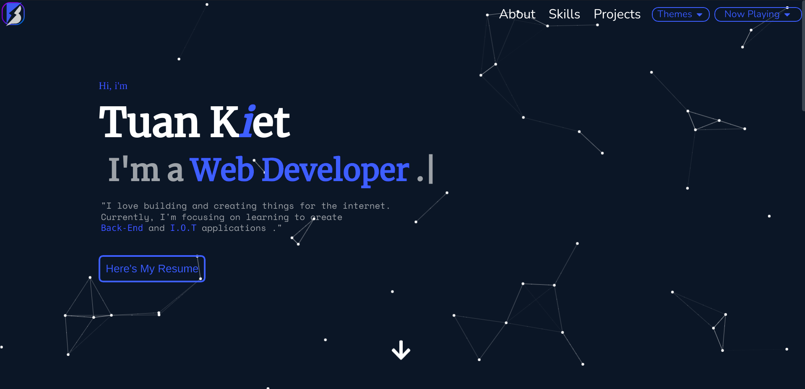

<div align="center">
<h1><p>My Personal Portfolio</p>
</h1>

<p><strong><a href="https://reactjs.org">React js</a> and <a href="https://nodejs.org">Node js</a> were used to develop this app.</strong></p>
</div>

<h1></h1>
<h2>Installation & Set Up :</h2>

**You need [Node Js](https://nodejs.org/) and [npm](https://www.npmjs.com/) to run this app**

To run the app, you can use this command :

Access the project directory :

```bash
cd MyPortfolio
```

Install dependencies :

```bash
npm install
```

or use yarn :

```bash
yarn
```

Runs the app in development mode :

```bash
npm start
```

or :

```bash
yarn start
```

**Open http://localhost:3000 to view it in the browser.**

<h1>
<h2> Build and Run Production :</h2>

To build Project run :

```bash
npm run build or yarn build
```

To run the app in production mode :

```bash
serve -s build
```

**_you can also launch it manualy by double-clicking index.html in the build folder._**
